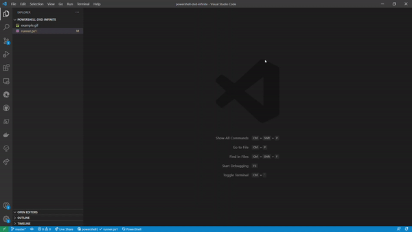

# Powershell DVD Infinite

📀 Powershell script to mimic the dvd logo infinite loop

 

### Inspiration

- DVD Logo for the logic behind the motion 
  
- Episode in "The Office" 
  

### Examples

- Speed: 1 millisecond 
  
- Speed: 0.1 millisecond 
  
